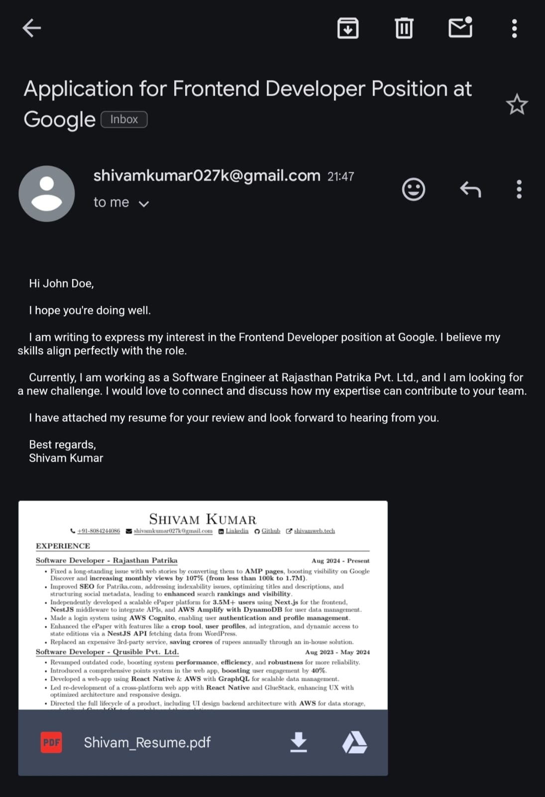

# Email Sender Bot

Must read the [NOTE](#note) section at the bottom of this file.
Star this project if you liked it.

Feel free to reach out to me at [shivam_27k](https://www.instagram.com/shivam_27k/) on instagram >\_<.

## Overview

This Python-based Email Sender Bot automates the process of sending personalized emails to multiple recipients listed in a CSV file. It customizes each email with the recipient’s name, job role, and company name while also attaching a resume.

## Features

-   Reads recipient details from a CSV file.

-   Sends personalized emails with customized greetings.

-   Automatically attaches a resume (PDF format) to each email.

-   Uses SMTP to send emails securely.

-   Logs sent emails to track the status.

# How to use Email Sender Bot

## Pre-requisites:

1. Install Python in your system.
2. Make sure you're in the root directory of this project

## Now you are ready to follow these steps:

#### Step 1: Install all the dependencies needed by running this command in the terminal:

`pip install -r requirements.txt`

#### Step 2: Replace `example.csv` file with your own csv file with similar fields and structure.

#### Step 3: Replace `example.pdf` file with the file you want to attach with your email.

#### Step 4: Go to `config.py` file and edit these lines:

```
SENDER_NAME = "your_name"
SENDER_EMAIL = "your_email@gmail.com"
SENDER_PASSWORD = "your_passsword"
RESUME_PATH = "your_resume_path"
CSV_FILE_PATH = "your_csv_file_path"
```

#### Step 5: Run the following command:

```
python email_sender.py
```

## Note:

-   `SENDER_PASSWORD` is NOT your gmail password.
    You will have to generate an `App Password` using this link: [Google App Password Generator](https://myaccount.google.com/apppasswords).

You will have to enable 2-factor authentication in your gmail to generate this app password.

Follow these steps to enable 2-factor authentication:

1. Open your [Google Account](https://myaccount.google.com/).
2. In the navigation panel, select "Security".
3. Under “How you sign in to Google,” select Turn on 2-Step Verification.
4. Follow the on-screen steps.

-   _Once you have enabled 2-step verification. Go to the link given above and generate your app password_

_Then copy and paste your '16 letters' password as it is there and you'll be good to go_

-   _You MUST edit and change the template of the message being sent in the "generate_email_content" function in the "email_utils" file_

## Results:

This will be sent to all the emails mentioned in the csv file with their respective name, email address and company name replaced.


